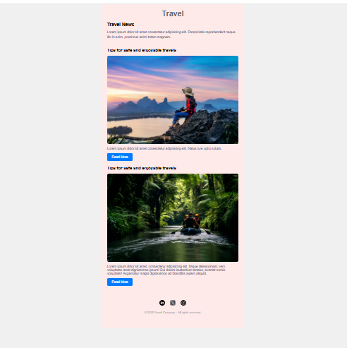

# hola-juniors-newsletter-template
first project for hola juniors - This is a responsive HTML email template created for a coding challenge.  
I tried to follow some of the best practices for email compatibility using HTML tables and inline CSS.

# HTML Email Template – Hola Juniors Challenge

This is my solution for the **"HTML Email Template"** challenge from [Hola Juniors](https://holajuniors.com).

## 📄 About the project

Task is to build a responsive HTML email template using HTML and inline CSS, following email design standards. The layout was based on a provided image reference.

## 🔧 Technologies
- HTML (table-based layout)
- Inline CSS (email-safe styling)

## 📸 Preview
_A screenshot of the email design_  

👉 [View on GitHub](https://github.com/JohtoSurfer/hola-juniors-newsletter-template)

##  GOAL 
- Create table-based layouts for emails.
- Apply spacing and typography using inline styles.
- Best practices for building email-compatible code.
- read mail chimp guide for email templates.

---

© 2025 – Coded by Luis Barrios
